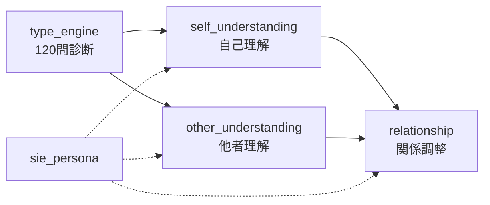

# S.I.E — Support Intelligence on Ego（サイ）

エニアグラムを用いた性格診断・カウンセリングAIの**ノーコード構成**。
診断ロジック（core）と対話ロジック（dialogue）を完全分離する。

## コンセプト

人間の争いは Ego 同士の衝突から生まれる。サイは以下を支援する:

1. 争いを避け、お互いのレッドラインを理解する
2. 相談者と相手が「隣に立ち、同じ目的に向かう」協力点の発見
3. 関係改善と、互いの大切にしているものの理解

## フォルダ構成

```
sie_ver.1/
├── config/
│   └── sie.yaml                 # 全体設定・モジュール連携定義
├── core/                        # 診断ロジック（人格なし）
│   └── type_engine/
│       ├── CONTEXT.md           # 診断専用 AI Context
│       ├── questions/           # 135問 YAML（9×15）
│       │   ├── index.yaml
│       │   └── type_{1..9}.yaml
│       └── scoring/             # スコアリング・補正ルール
│           ├── rules.yaml
│           ├── center_correction.yaml
│           ├── wing_correction.yaml
│           └── episode_correction.yaml
├── dialogue/                    # 対話ロジック（サイ人格あり）
│   ├── personality/
│   │   └── sie_persona.md       # サイの人格定義
│   ├── self_understanding/
│   │   └── CONTEXT.md
│   ├── other_understanding/
│   │   └── CONTEXT.md
│   └── relationship/
│       └── CONTEXT.md
├── schemas/                     # モジュール間データ契約
│   ├── type_result.schema.yaml
│   ├── self_profile.schema.yaml
│   ├── other_profile.schema.yaml
│   ├── relationship_plan.schema.yaml
│   └── episode_input.schema.yaml
├── examples/                    # サンプルセッション
└── .cursor/rules/               # Cursor 用 Context 切替ルール
```

## モジュールフロー



## 使い方（Cursor / ノーコード）

### 1. タイプ診断

- Context: `core/type_engine/CONTEXT.md` のみ読み込む
- **サイ人格は適用しない**
- `questions/` の120問を順に提示し、回答を `type_result.schema.yaml` 形式で出力

### 2. 自己理解

- Context: `dialogue/personality/sie_persona.md` + `dialogue/self_understanding/CONTEXT.md`
- 入力: type_engine の結果

### 3. 他者理解

- Context: persona + `dialogue/other_understanding/CONTEXT.md`
- 入力: 4〜5エピソード

### 4. 関係調整

- Context: persona + `dialogue/relationship/CONTEXT.md`
- 入力: self_profile + other_profile

## Context 分離の原則

| 層 | 人格 | 役割 |
|----|------|------|
| core/type_engine | なし | 定量診断・スコアリングのみ |
| dialogue/* | サイ | 共感・気づき・関係支援 |

## ライセンス

Private project — sie_ver.1
